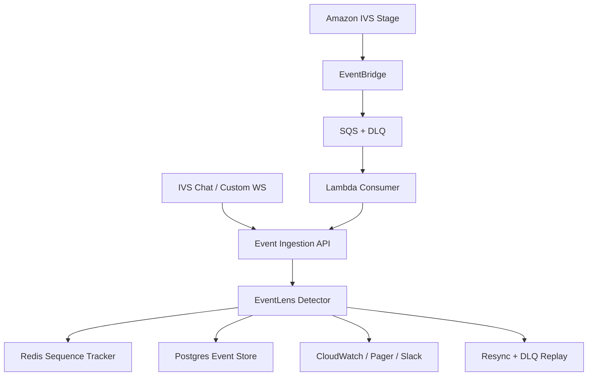

# Antakshari Event Model

This document captures the backend-first shape of EventLens.
The goal is not to rebuild the full Antakshari game; it is to detect when event contracts break.

## Product Flow

1. User enters Antakshari from the ZEE5 profile section.
2. Antakshari has its own auth, onboarding, username/avatar setup, and guest mode.
3. Main screen shows public/private rooms, global leaderboard, and create-room flow.
4. A room has up to four participants. Everyone else is a viewer or guest.
5. Lobby shows participant grid plus IVS-style floating chat.
6. Gameplay starts when the backend moderator chooses a syllable and first player.
7. Player speech is converted to text and sent every few seconds through IVS chat/custom events.
8. Backend evaluates the song, score, next syllable, next player, and current round.
9. Android/iOS have local moderator logic for temporary offline handling, but backend remains the source of truth.

## Event Sources

- `IVS_STAGE`: participant joined, left, published, subscribed.
- `IVS_EVENTBRIDGE`: session and IVS delivery events.
- `IVS_CHAT`: chat comments and custom gameplay messages.
- `CUSTOM_WEBSOCKET`: direct game-control messages.
- `ANDROID_CLIENT` / `IOS_CLIENT`: local state snapshots, foreground/background, ACKs.
- `BACKEND_MODERATOR`: authoritative phase, turn, score, leaderboard, and game-end events.
- `LAMBDA_CONSUMER`: EventBridge/SQS consumer telemetry.
- `SQS_DLQ_REPROCESSOR`: replay and recovery telemetry.

## Critical Invariants

- Backend-processed gameplay events must be monotonic per `streamId`.
- Every critical game event must carry `eventId`, `sequence`, `gameId`, `participantId`, `turnId`, and `roundNumber`.
- A result event must match the backend moderator's active `turnId` and active `participantId`.
- Participant-only commands must never be accepted from guest/viewer tokens.
- Mobile screens must reconcile from backend phase after foreground/resume.
- IVS media teardown must follow `GAME_ENDED` before users leave the room.
- Chat ordering must not affect game-control ordering.
- DLQ records must be replayable and idempotent.

## Detection Matrix

| Failure | Example | Classification | Recovery idea |
| --- | --- | --- | --- |
| IVS event matched but not enqueued | EventBridge receives `buzz-in`, SQS count does not move | `EVENTBRIDGE_TO_SQS_DROP` | EventBridge retry policy, DLQ target, enqueue-count alarm |
| SQS backlog | Gameplay event sits in queue while turn keeps waiting | `LAMBDA_THROTTLE_OR_SQS_BACKLOG` | Reserved concurrency, visibility timeout tuning, queue-age alarm |
| Lambda starts but backend never sees event | Consumer crashes after parsing event | `LAMBDA_CONSUMER_FAILURE` | Persist raw event first, idempotent handler, DLQ replay |
| Player waits forever after singing | `ANSWER_SUBMITTED` has no result, then next turn starts | `MISSING_BACKEND_RESPONSE` | Command/result timeout and room resync |
| Previous player result shown | `SCORE_UPDATED` for `turn-1` during active `turn-2` | `STALE_TURN_RESULT` | Reject stale turn IDs and broadcast current state snapshot |
| Local moderator drifts | Android thinks lobby, backend already gameplay | `MODERATOR_STATE_DRIFT` | Versioned backend snapshot on reconnect/resume |
| App resumes stale screen | User backgrounds during lobby, resumes after game started | `STALE_CLIENT_SCREEN` | Route by backend phase, not restored fragment |
| Leaderboard overlap | New round starts before 5-second leaderboard closes | `ROUND_DIALOG_OVERLAP` | Server-timed phase transition |
| Audio leak | IVS audio continues after `GAME_ENDED` | `AUDIO_LEAK_AFTER_GAME_END` | Media teardown ACK before navigation |
| Guest plays | Guest sends `BUZZ_IN` or transcript chunk | `GUEST_PARTICIPATION_BYPASS` | Backend role/onboarding gate |
| Chat order drift | Comments and game-control messages share IVS channel | `CHAT_ORDER_DRIFT` | Separate channels or ordering keys |

## Backend Architecture Target

The current project implements the detector in memory. Redis/Postgres can be added behind the same API once the detection rules are stable.
